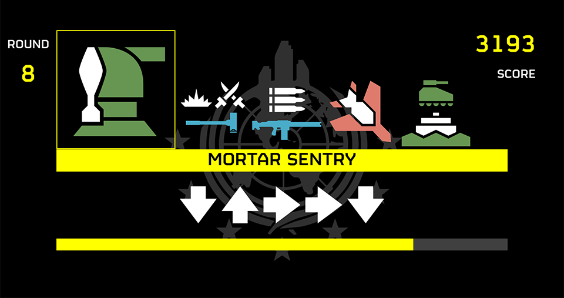
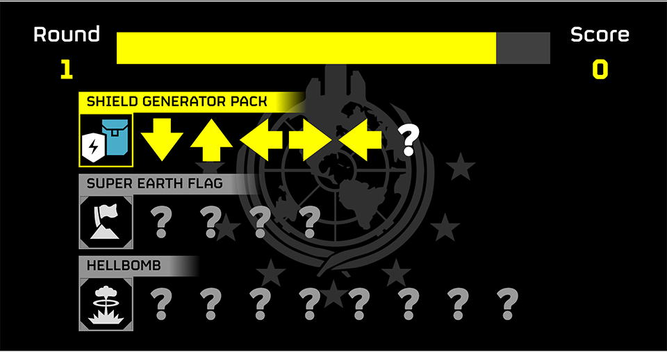
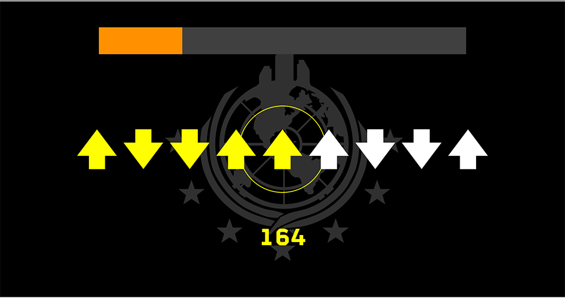
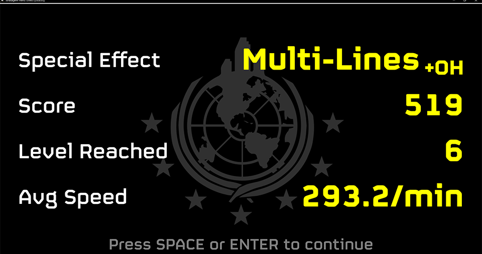
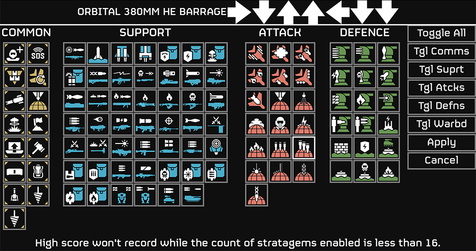

[中文介绍点这里](.github/README_ZH.md)

# Stratagem Hero: Effect
"Stratagem Hero: Effect" is the minigame "Stratagem Hero" what is able to play on ships which owned by players have "Super Citizen Edition" DLC in the video game "Helldivers2", but made with GodotEngine and contains some extra gameplay.

  
  
  
  
  

# There were some duplicated works on Internet already, is this one has any special?
Of course bro.  
This project has stratagems selection function and few interesting special effect modes, they can help you practicing efficiently.  
And a high score function is holding your best record on every mode with your score, you reached level and your speed.  
And finally, this project provides you a better experience by its smooth animated UI re-designed, instead of the copy of original minigame actually.

# Game Mode
There're two basic game mode, "Classic Mode" and "Effect Mode".

## Classic Mode
It is the imitation of the original minigame. Just it.

## Effect Mode
The collection of special effect modes.

### Special Effec Modes

#### None
  A normal mode with Effect Mode UI and classic gameplay.  
  It is suitable for doing some basic practice.

#### Dictation
  A mode won't showing arrows. It gives you more time and greater penalty on you wrong.  
  It is suitable for testing your memory.

#### Great Wall
  A mode with infinited continuous random arrows.  
  It is suitable for practicing your real-time planning skill.

#### Multi-Lines
  A mode shows 4 stratagems at same time, you can choose which one to complete first follow your idea, and also allow you transfer to other stratagems if you wrong.  
  It is suitable for practicing your complex strength.

#### Terminal
  A mode simulates long random codes of terminals which you are able to seen in mission.  
  It is suitable for practicing your skill for terminal operating.

### One Heart
A function is able to attach on any effect modes. While enabled, you'll gameover if just wrong once.  
You can use it to practicing don't wrong.

# Special Thanks
[https://github.com/nvigneux/Helldivers-2-Stratagems-icons-svg](https://github.com/nvigneux/Helldivers-2-Stratagems-icons-svg): This repository and pull requests in it provided almost all image resources for this project.  
[Bilibili@博学橘耄](https://space.bilibili.com/321884781): Help to extract audio resources.  
[Bilibili@幽狐HOFOX](https://space.bilibili.com/392986318): Early testing and making knowns.  
[Bilibili@CastleonRS](https://space.bilibili.com/356117433): Provided an order of stratagems in Effect Mode.  